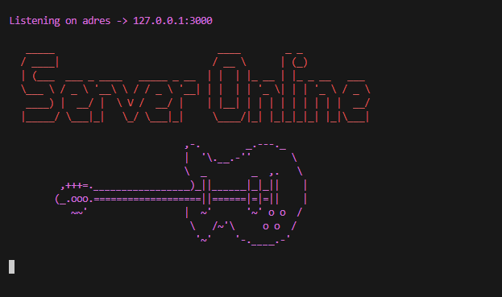

# 🎸 Guitarra
Static files router written in Go with Fiber 🔷



## Installation executable
Just download latest realease

## How to Use
Run downloaded program like below, it will host your files from `foldername` on adres -  `127.0.0.1:3000`.
```bash
$ ./router.exe -f foldername
```

### Change port
To change default port you have to add port flag like below. In this example port is set to `3030`.
```bash
$ ./router.exe -f foldername -port=3030
```

## Reload and edit files
- If you added new file, you should reload files. Just press `r` key in Cli. 
- If you changed file content you dont need  to reload files.
  

## Routing system
Routing system is based on folder strucutre

- `+` Prefix in filename mean file is public and will be hosted, files without `+` prefix in filename are private. Hosted files had removed `+` prefix.
  
    <b>📖 mysite/+message.txt `->` mysite/message.txt</b>


- `+page.html` - Main file in route, will be hosted on route without filename.

    <b>📖 mysite/about/+page.html `->` mysite/about</b>


- Dynamic route is created with `[` - prefix and `]` - suffix .

    <b>📖 mysite/news/[title] `->` mysite/news/whatever</b>


## Run from source
Clone the project

```bash
  git clone github.com/Pla9er9/Guitarra
```

Go to the project directory

```bash
  cd Guitarra
```

Start the server with example

```bash
  go run . -f .\example
```
## Run tests
To run tests, run the following command
```go
go test
```

## MIT License
